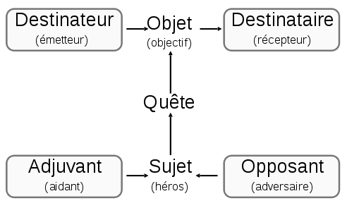
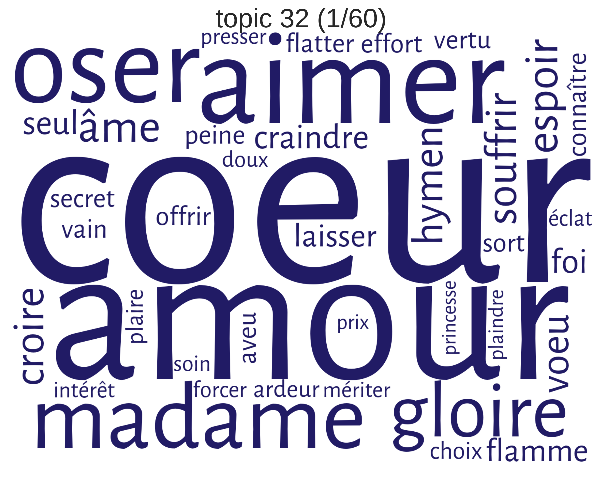
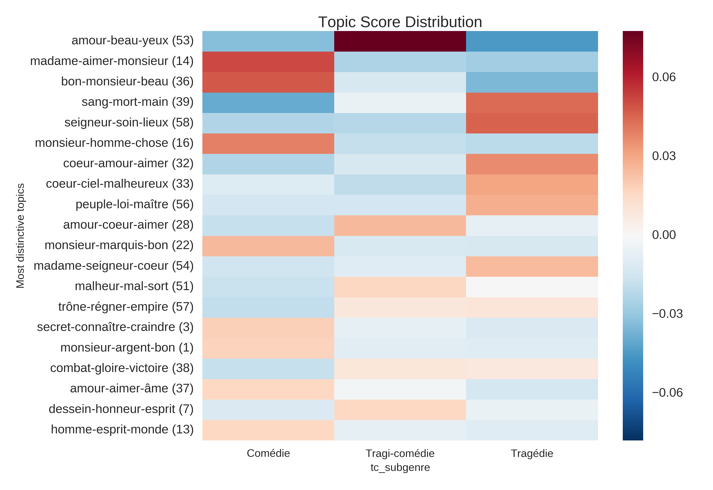

Cours Stylistique numérique

# Le lexique

Simon Gabay
Neuchâtel, Mardi 24 février 2020

---
# Premier débroussaillage

---
## Zola, _Une page d'amour_, 1989

>Mais Hélène était en plein ciel. Les arbres pliaient et craquaient comme sous des coups de vent. On ne voyait plus que le tourbillon de ses jupes qui claquaient avec un bruit de tempête. Quand elle descendait, les bras élargis, la gorge en avant, elle baissait un peu la tête, elle planait une seconde ; puis, un élan l’emportait, et elle retombait, la tête abandonnée en arrière, fuyante et pâmée, les paupières closes. C’était sa jouissance, ces montées et ces descentes, qui lui donnaient un vertige. En haut, elle entrait dans le soleil, dans ce blond soleil de février, pleuvant comme une poussière d’or. Ses cheveux châtains, aux reflets d’ambre, s’allumaient ; et l’on aurait dit qu’elle flambait tout entière, tandis que ses nœuds de soie mauve, pareils à des fleurs de feu, luisaient sur sa robe blanchissante. Autour d’elle, le printemps naissait, les bourgeons violâtres mettaient leur ton fin de laque, sur le bleu du ciel.

---
## Huysmans, _À rebours_, 1884

>Ainsi, par haine, par mépris de son enfance, il avait pendu au plafond de cette pièce une petite cage en fil d’argent où un grillon enfermé chantait comme dans les cendres des cheminées du château de Lourps ; quand il écoutait ce cri tant de fois entendu, toutes les soirées contraintes et muettes chez sa mère, tout l’abandon d’une jeunesse souffrante et refoulée, se bousculaient devant lui, et alors, aux secousses de la femme qu’il caressait machinalement et dont les paroles ou le rire rompaient sa vision et le ramenaient brusquement dans la réalité, dans le boudoir, à terre, un tumulte se levait en son âme, un besoin de vengeance des tristesses endurées, une rage de salir par des turpitudes des souvenirs de famille, un désir furieux de panteler sur des coussins de chair, d’épuiser jusqu’à leurs dernières gouttes, les plus véhémentes et les plus âcres des folies charnelles.

---
## Camus, _L'Etranger_, 1942

>Aujourd’hui, maman est morte. Ou peut-être hier, je ne sais pas. J’ai reçu un télégramme de l’asile: «Mère décédée. Enterrement demain. Sentiments distingués.» Cela ne veut rien dire. C’était peut-être hier. L’asile de vieillards est à Marengo, à quatre-vingts kilomètres d’Alger. Je prendrai l’autobus à deux heures et j’arriverai dans l’après-midi. Ainsi, je pourrai veiller et je rentrerai demain soir. J’ai demandé deux jours de congé à mon patron et il ne pouvait pas me les refuser avec une excuse pareille. Mais il n’avait pas l’air content. Je lui ai même dit : « Ce n’est pas de ma faute. » II n’a pas répondu. J’ai pensé alors que je n’aurais pas dû lui dire cela. En somme, je n’avais pas à m’excuser. C’était plutôt à lui de me présenter ses condoléances. Mais il le fera sans doute après-demain, quand il me verra en deuil. Pour le moment, c’est un peu comme si maman n’était pas morte. Après l’enterrement, au contraire, ce sera une affaire classée et tout aura revêtu une allure plus officielle.

---
## Beckett, _En attendant Godot_, 1952

>VLADIMIR. - Toi aussi, tu dois être content, au fond, avoue-le.
ESTRAGON. - Content de quoi ?
VLADIMIR. - De m'avoir retrouvé.
ESTRAGON. - Tu crois ?
VLADIMIR. - Dis-le, même si ce n'est pas vrai.
ESTRAGON. - Qu'est-ce que je dois dire ?
VLADIMIR. - Dis, Je suis content.
ESTRAGON. - Je suis content.
VLADIMIR. - Moi aussi.
ESTRAGON. - Moi aussi.
VLADIMIR. - Nous sommes contents.
ESTRAGON. - Nous sommes contents. (Silence) Qu'est-ce qu'on fait, maintenant qu'on est content ?
VLADIMIR. - On attend Godot.
ESTRAGON. - C'est vrai.
(Silence)

---
## Le Naturalisme

>« J'en suis donc parvenu à ce point : le roman expérimental est une conséquence de l'évolution scientifique du siècle ; il continue et complète la physiologie, qui elle-même s'appuie sur la chimie et la physique ; il substitue à l'étude de l'homme abstrait, de l'homme métaphysique, l'étude de l'homme naturel, soumis aux lois physico-chimiques et déterminé par les influences du milieu ; il est en un mot la littérature de notre âge scientifique, comme la littérature classique et romantique a correspondu à un âge de scolastique et de théologie. »

Zola, _Le Roman expérimental_, 1902

---
## L'écriture blanche

>Dans ce même effort de dégagement du langage littéraire, voici une autre solution : créer une écriture blanche, libérée de toute servitude à un ordre marqué du langage. Une comparaison empruntée à la linguistique rendra peut-être assez bien compte de ce fait nouveau : on sait que certains linguistes établissent entre les deux termes d'une polarité (singulier-pluriel, prétérit-présent), l'existence d'un troisième terme, terme neutre ou terme-zéro; ainsi entre les modes subjonctif et impératif, l'indicatif leur apparaît comme une forme amodale.

Barthes, _Le Degré zéro de l'écriture_, 1953

---

* On relève donc des faits de mode, liés à l'époque: Huysmans et Zola sont proches, Beckett et Camus aussi
* Dimension politique du style

---
# Sémantique

---
## Sème

En sémantique, le sème est l'unité minimale de signification, non susceptible de réalisation indépendante.

> « le sens d'un mot n'est pas une unité indivisible, mais composée, les mêmes sèmes se retrouvent tout au long du vocabulaire »

T. Todorov

En faisant de l'analyse sémique, on décompose selon que les sèmes soient positifs ou négatifs:

|        | mouton | masculin | adulte |
|--------|--------|----------|--------|
| agneau |   +    |    +     |   -    |
| brebis |   +    |    -     |   +    |
| bélier |   +    |    +     |   +    |

L'agneau (attention à la notation) a les traits \[+ masculin], \[- adulte]. Agneau et brebis se distinguent par le trait \[± adulte].


---
## Sémème

Le terme de _sème_, inventé par E. Buyssens, est donc synonyme de _trait sémantique_ . Rassemblés en faisceau, ces sèmes forment un _sémème_.

L'exemple le plus célèbre est celui du fauteuil de B. Pottier:

```
S1 = avec dossier
S2 = sur pieds
S3 = pour une seule personne
S4 = pour s'asseoir
S5 = avec des bras
```

on voit que :
```
Le sémème du terme chaise regroupe (S1 + S2 + S3 + S4)
Le sémème du terme fauteuil regroupe (les sèmes de chaise
+ S5)
Le sémème général, ou archisémème de l'ensemble des
sièges,regroupe (S2 + S4).
```
Le sémème a pour correspondant formel le lexème.

---
##  Lexème

Le léxème est une unité lexicale, soit le morphème lexical d’un lemme. Même si ce n'est pas tout à fait juste (notamment en diachronie), on identifie souvent le léxème au radical.

Il faut différencier:
* le léxème lié, qui nécessite un autre morphème comme un suffixe de dérivation (_aim-able_) ou une désinence (_aim-iez_)
* le léxème libre, qui se suffit à lui-même: _choix_ ne s'écrit que sous cette forme, car il ne peut recevoir de marque de flexion (autre que la flexion zéro)

Attention: il ne faut pas confondre les léxèmes des morphèmes grammaticaux (_la_, _un_, _de_ …), qui sont dépendants d'autres termes de la phrase.

---
## Raffinements

Il est possible de complexifier ces notions. François Rastier propose ainsi de distinguer des sèmes inhérents des sèmes afférents.

>Si l’on veut décrire le système linguistique au sens large, qui comprend, outre le système fonctionnel de la langue, des normes socialisées à l’œuvre dans les textes, on doit retenir, avec les sèmes inhérents, les sèmes afférents socialement normés.
>Un exemple permettra de montrer combien il est nécessaire de tenir compte des afférences socialement normées, pour peu qu’on se soucie de la compétence réelle, et non pas seulement de la compétence idéalisée. Le Petit Larousse définit ainsi caviar : « Œufs d’esturgeon salés. » Ce type de définition nous paraît insuffisant, car le trait [+ luxueux] devrait y figurer. \[...]

François Rastier, _Sémantique interprétative_, 1987

---
## Champ lexical

Un sémème appartient toujours à un champ lexical – c'est-à-dire qu'il est apparenté sémantiquement à d'autres unités lexicales. Pour faire très simple: nous partons d'une chose pour repérer les mots qui gravitent autour de cette chose.

Ainsi "tournevis", "clef", "marteau", "scie" appartiennent au _champ lexical_ d'un même _champ notionnel_ du bricolage. Des mots appartenant à un champ lexical appartiennent normalement à la même partie du discours.

Il faut distinguer le champ lexical de l'isotopie, qui est pourtant relativement proche.

---
# A. J. Greimas

* 1917 (Toula, Russie) - 1992 (Paris)
* linguiste et sémioticien d'origine lituanienne et d'expression française
* Resté célèbre pour son "schéma actantiel"


Source: [Wikipedia](https://commons.wikimedia.org/wiki/File:Sch%C3%A9ma_actantiel.svg?uselang=fr)

* Ce schéma actantiel repose sur un postulat binariste, qui serait une des caractéristiques de l'esprit humain et se retrouve en sémantique (avant/après, blanc/noir…)

---
## Isotopie

>« un ensemble redondant de catégories sémantiques qui rend possible la lecture uniforme du récit, telle qu'elle résulte des lectures partielles des énoncés et de la résolution de leurs ambiguïtés qui est guidée par la recherche de la lecture unique. »

A. J. Greimas, _Du sens. Essais sémiotiques_, Le Seuil, 1970

* L'isotopie se joue à un niveau inférieur au mot. Ainsi "L'aube allume la source" (Eluard) présente le sème [\+commencement] ou [\+inchoativité]
* L'isotopie s'appuie sur le contexte. Ainsi l'exemple de Greimas _le chien aboye_ / _le commissaire aboye_, dans lequel _aboyer_ a deux classèmes (humain et canin) et c'est le contexte (le sujet de la phrase) qui permet de comprendre lequel est activé.

---
## Classème vs sémantème

L'existence de sèmes communs, peut être affinée: on va parler, avec B. Pottier (_Linguistique générale : théorie et description_, 1974) de:
* Sémantème, pour les sèmes dénotatifs et spécifiques (il permet de distinguer le mot dans un paradigme): _tricycle_ a le sémantème "trois", bicycle le sémantème "deux"
* Classème, pour les sèmes dénotatifs et génériques: _tricycle_ a le sémantème "vehicule"

En se basant sur une analyse fine des sèmes, et surtout des classèmes, on va plus loin que le simple champ lexical, et on dégage des isotopies.

---

Exemple 1:

>Mais les gens de mon air, Marquis, ne sont pas faits,
Pour aimer à crédit, et faire tous les frais.
Quelque rare que soit le mérite des belles,
Je pense, Dieu merci, qu’on vaut son prix comme elles ;
Ce n’est pas la raison qu’il ne leur coûte rien ;
Et qu’au moins, à tout mettre en de justes balances,
Il faut qu’à frais communs se fassent les avances (815-822).

Molière, _Le Misanthrope_, 1666

Exemple 2:

>La terre est bleue comme une orange

Eluard, _L'Amour la poésie_, 1929

---

Exemple 1:

>Mais les gens de mon air, Marquis, ne sont pas faits,
Pour aimer à **crédit**, et faire tous les **frais**.
Quelque rare que soit le mérite des belles,
Je pense, Dieu merci, qu’on vaut son **prix** comme elles ;
Ce n’est pas la raison qu’il ne leur coûte rien ;
Et qu’au moins, à tout mettre en de justes **balances**,
Il faut qu’à **frais communs** se fassent les **avances** (815-822).

Molière, _Le Misanthrope_, 1666

Exemple 2:

>La terre est bleue comme une orange

Eluard, _L'Amour la poésie_, 1929

---

>De larges plaques de lèpre jaune marbraient les tuiles brunies et désordonnées des toits, dont les chevrons pourris avaient cédé par places ; la rouille empêchait de tourner les girouettes, qui indiquaient toutes un vent différent ; les lucarnes étaient bouchées par des volets de bois déjeté et fendu. Des pierrailles remplissaient les barbacanes des tours ; sur les douze fenêtres de la façade, il y en avaient huit barrées par des planches ; les deux autres montraient des vitres bouillonnées, tremblant, à la moindre pression de la bise, dans leur réseau de plomb. Entre ces fenêtre, le crépi, tombé par écailles comme les squames d’une peau malade, mettait à nu des briques disjointes, des moellons effrités aux pernicieuses influences de la lune ; la porte, encadrée d’un linteau de pierre, dont les rugosités régulières indiquaient une ancienne ornementation émoussée par le temps et l’incurie \[…]

Gautier, _Capitaine Fracasse_, 1863

---

>De larges plaques de **lèpre** jaune marbraient les TUILES brunies et désordonnées des TOITS, dont les CHEVRONS pourris avaient cédé par places ; la rouille _empêchait_ de tourner les GIROUETTES, qui indiquaient toutes un vent différent ; les LUCARNES étaient _bouchées_ par des VOLETS de bois déjeté et fendu. Des pierrailles _remplissaient_ les BARBACANES des TOURS ; sur les douze FENÊTRES de la FAÇADE, il y en avaient huit _barrées_ par des planches ; les deux autres montraient des VITRES bouillonnées, tremblant, à la moindre pression de la bise, dans leur réseau de plomb. Entre ces FENÊTRES, le CRÉPI, tombé par _écailles_ comme les **squames** d’une **peau malade**, mettait à nu des BRIQUES disjointes, des MOELLONS effrités aux pernicieuses influences de la lune ; la PORTE, encadrée d’un LINTEAU de pierre, dont les rugosités régulières indiquaient une ancienne ORNEMENTATION émoussée par le temps et l’incurie \[…]

Gautier, _Capitaine Fracasse_, 1863

---

Chez Molière on en reste au simple champ lexical de la finance.

Chez Eluard, on a un jeu sur les isotopies de la rondeur (_terre_, _orange_) et de la couleur (_bleue_, _orange_) par delà le sens direct.

Chez Gautier, on va parler d'isotopies plurielles, ou de poly-istotopie.

---
## Isotopies

Il existe plusieurs types d'isotopies

>Au sens strict, on appelle isotopie l’itération d’un sème d’une lexie à l’autre. \[…] Au sens large, on appelle isotopie une itération sémantique quelconque \[…]. L’isotopie prend donc en compte toutes sortes de phénomènes linguistiques (phénomènes phonétiques, phrases, figures, éléments dénotatifs et connotatifs, etc.).

Cl. Stolz, _Initiation à la stylistique_

* Isotopie sémantique: récurrence des sèmes
* Isotopie phonétique: récurrence des phonèmes
* Isotopie prosodique: récurrence des intonations, pauses et accents
* Isotopie stylistique: récurrence de traits
* Isotopie rhétorique: récurrence des procédés

---
## Hétérotopie

Il s'agit d'une rupture de l'isotopie: le lecteur doit alors résoudre l'incohérence par lui-même, souvent en passant par l'analyse figurale. En ce sens, l'hétérotopie amorce une lecture rhétorique. L'hypallage est une figure de style souvent associée à l'hétérotopie.

Une hypallage consiste à introduire une rupture en attribuant à certains mots ce qui convient logiquement à d’autres mots de la même phrase.

>Ce marchand accoudé sur son comptoir avide

Victor Hugo, _Les Chants du crépuscule_ (1835).

---
Logiquement, il existe un lien fort entre l'isotopie et l'hétérotopie, si la seconde est une rupture de la première:

>Un vieillard en or avec une montre en deuil
Une reine de peine avec un homme d’Angleterre
Et des travailleurs de la paix avec des gardiens de la mer
Un hussard de la farce avec un dindon de la mort
Un serpent à café avec un moulin à lunettes
Un chasseur de cordes avec un danseur de têtes

Prévert, _Paroles_ (1946)

L'isotopie est ici double: sémantique, mais aussi rhétorique avec la répétition des hypallages.

---
## Polysémie

Définition: un mot ou une expression qui a plusieurs sens ou significations différentes. Regardons les citations suivantes:

>Le cœur a ses raisons que la raison ne connaît pas

Pascal, _Pensées_, posth.

>Brûlé de plus de feux que je n’en allumai

Racine, Andromaque, 1667

---
## Figures de style

Une figure de style (lat. _figura_) est un procédé d’écriture qui s’écarte de l’usage ordinaire de la langue et donne une expressivité particulière au propos. On parle aussi de figure de rhétorique, du fait de l'importance de ces figures pour la rhétorique.

On les classe et on les étudie depuis l'antiquité, raison pour laquelle elles ont souvent un nom grec (ou latin). Dans les deux exemples précédents:

* Antanaclase: répétition d’un même mot, mais en l’employant dans deux sens différents.
* Syllepse: emploi d'un mot dans son sens propre et dans son sens figuré en même temps.

---
# Approche computationnelle

---
## L'indice prononminal

Concept développé par Charles Muller, dont le principe est simple: le Rapport  entre  le  nombre  des  pronoms  personnels  “de  dialogue”  (1ère  et  2e  personne  du singulier  et  du  pluriel)  et  le  nombre  des  possessifs  (adjectifs  et  pronoms)  des  mêmes personnes  varient  de  façon  significative.

>D’une façon générale l’indice pronominal est élevé quand le style est familier, bas quand le style tend à la noblesse ou au lyrisme. Les valeurs les plus hautes (faible propotion des possessifs par rapport aux personnels) ont été observées dans le langage parlé (relevés du français fondmental), ou dans les œuvres qui cherchent à le reproduire (comédie du boulevard); les valeurs les plus faibles, voisines de l'unité, dans les recueils lyriques (par exemple _les Fleurs du Mal_)

Muller, _Le Vocabulaire du théâtre de Pierre Corneille_, 1967, p. 118.

---
## Charles Muller

* 1909 (Strasbourg) - 2015 (Paris)
* pionnier de la statistique linguistique: sa thèse _Essai de statistique lexicale : « L'Illusion comique » de Pierre Corneille_ date de 1967!
* Créateur des logiciel _PISTES_, qui permet de trier par ordre alphabétique et de faire des calculs statistiques (!) et _MELI_ qui permet de faire de la lemmatisation
* Tradition lexicométrique du laboratoire de Saint-Cloud

---
>Ma foi, **je** ne sais pas,
Quand on verra finir ce galimatias,
Déjà depuis longtemps **je** tâche à le comprendre,
Et si plus **je** l’écoute, et moins **je** puis l’entendre :
**Je** vois bien à la fin que **je** m’en dois mêler.

Molière, _Sganarelle_, 1660

>Laissez-**moi**, loin de vous, et loin de ce rivage,
De **mon** fils déchiré fuir la sanglante image.
Confus, persécuté d’un mortel souvenir,
De l’univers entier je voudrais **me** bannir.
Tout semble s’élever contre **mon** injustice ;
L’éclat de **mon** nom même augmente **mon** supplice :

Racine, _Phédre_, 1677

---

## Le _Token type ratio_

L'ordinateur est très bête, mais il sait très bien compter: il est très facile d'analyser des lexiques et notamment d'en évaluer la richesse.

Une des tâches les plus connue est le calcul du _token/type ratio_ (TTR), qui permet de calculer la richesse d'un lexique:

>A world of victory after victory, triumph after triumph after triumph: an endless pressing, pressing, pressing upon the nerve of power.

Orwell, _1984_

On remarque que la répétition des mêmes mots diminue le TTR.

| A | world | of | victory | after | victory, | triumph | after | triumph|
|---|-------|----|---------|-------|----------|---------|-------|--------|
| 1 | 2     | 3  | 4       | 5     | 6        | 7       | 8     | 9      |
| 1 | 2     | 3  | 4       | 5     | 5        | 6       | 6     | 6      |

cf. R. van Hout, A. Vermeer, "Comparing measures of lexical richness", 2007

---

### Identifier les lexèmes

Compter les mots permet d'évaluer leur fréquence dans un texte, mais aussi dans un grand corpus. Cela permet par exemple de retrouver les hapax (mot de fréquence 1), les mots rares, les changements de sens…

Exemple 1. Dans cet exemple, quel mot pourrait-on commenter?

>Un Rat hôte d'un champ, Rat de peu de cervelle,
Des Lares paternels un jour se trouva soû.
Il laisse là le champ, le grain, et la javelle,
Va courir le pays, abandonne son trou.
            Sitôt qu'il fut hors de la case,
Que le monde, dit-il, est grand et spacieux !
Voilà les Apennins, et voici le Caucase :
La moindre taupinée était mont à ses yeux.

La Fontaine, _Le Rat et l'huître_

---

>Un Rat hôte d'un champ, Rat de peu de cervelle,
Des Lares paternels un jour se trouva soû.
Il laisse là le champ, le grain, et la javelle,
Va courir le pays, abandonne son trou.
            Sitôt qu'il fut hors de la **case**,
Que le monde, dit-il, est grand et spacieux !
Voilà les Apennins, et voici le Caucase :
La moindre taupinée était mont à ses yeux.

Cf. Garagnon, « Dans une acception calquée sur l'étymon _casa_ (chaumière) et réactivée au XVIIe siècle sous l'influence de l'italien, _case_ désigne “une cabane, une petite habitation de style rustique”. La spécialisation propre aux pays chauds (hutte, paillotte) apparaît dès l'époque classique, dans La _Relation du voyage au Cap-Vert_ »

---
## Automatisation de la reconnaissance

Nous allons pouvoir mettre en valeur de l'information lexicale directement dans le texte, en soulignant certains mots.

Regardons les premières lignes de _Toine_, et mettons en majuscules:
* les mots dont l'écart-réduit est supérieur 3
* les mots dont la fréquence dans _Toine_ > 2

par rapport à un corpus de référence de 350 romans et nouvelles de 1830 à 1970 issu de Frantex

---
>On  le  connaissait  à  dix  lieues  aux  environs  le  père  Toine,  le  GROS  Toine,  Toine-ma-fine, Antoine Mâcheblé, dit Brûlot, le cabaretier de Tournevent.

>Il  avait  rendu  célèbre  le  hameau  enfoncé  dans  un  pli  du  vallon  qui  descendait  vers  la  mer,  pauvre hameau paysan composé de dix maisons normandes entourées de fossés et d' arbres.

>Elles étaient là, ces maisons, blotties dans ce ravin couvert d' herbe et d' ajonc, \[...]

---

>ON  le  connaissait  à  DIX  lieues  aux  environs  le  père  Toine,  le  GROS  Toine,  Toine-ma-FINE, Antoine Mâcheblé, dit Brûlot, le CABARETIER de Tournevent.

>Il  avait  rendu  célèbre  le  HAMEAU  enfoncé  dans  un  pli  du  vallon  qui  descendait  vers  la  mer,  pauvre HAMEAU PAYSAN composé de DIX MAISONS normandes entourées de fossés et d' arbres.

>Elles étaient là, ces MAISONS, blotties dans ce ravin couvert d' herbe et d' ajonc, \[...]

---
## Le modèle de sujet

Il s'agit d'une approche non supervisée de la langue, de type _bag of words_ ("sac de mots"). L'algorithme (souvent _LDA_) tente de repérer un nombre _n_ des co-occurrences récurrentes (des sujets, ou _topics_).

On représente souvent les _topics models_ sous la forme de nuages de mots, ceux écrits en plus grand étant les plus importants.



---

À partir de ce type d'approche, il est possible de dégager des grandes tendances et de questionner, par exemple, la répartition en genre de manière purement empirique.



Schöch, "Topic Modeling Genre", 2017

