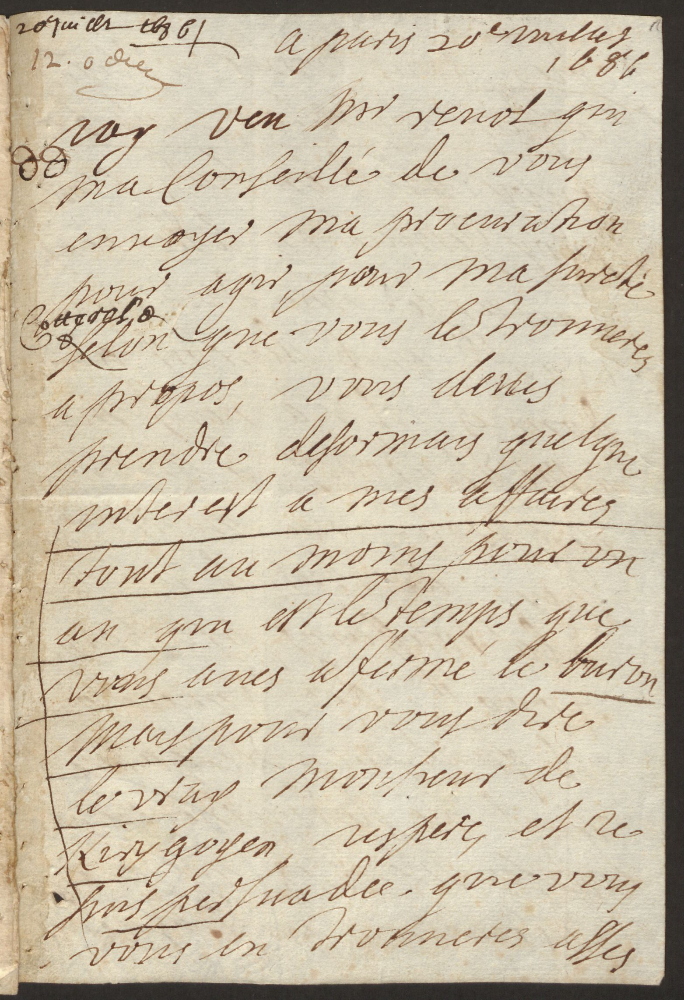

Cours Stylistique numérique

# La (sous-)phrase

Simon Gabay
Neuchâtel, Mardi 10 mars 2020

---
# Introduction (la même que la dernière fois)
---
## Zola, _Une page d'amour_, 1989

>Mais Hélène était en plein ciel. Les arbres pliaient et craquaient comme sous des coups de vent. On ne voyait plus que le tourbillon de ses jupes qui claquaient avec un bruit de tempête. Quand elle descendait, les bras élargis, la gorge en avant, elle baissait un peu la tête, elle planait une seconde ; puis, un élan l’emportait, et elle retombait, la tête abandonnée en arrière, fuyante et pâmée, les paupières closes. C’était sa jouissance, ces montées et ces descentes, qui lui donnaient un vertige. En haut, elle entrait dans le soleil, dans ce blond soleil de février, pleuvant comme une poussière d’or. Ses cheveux châtains, aux reflets d’ambre, s’allumaient ; et l’on aurait dit qu’elle flambait tout entière, tandis que ses nœuds de soie mauve, pareils à des fleurs de feu, luisaient sur sa robe blanchissante. Autour d’elle, le printemps naissait, les bourgeons violâtres mettaient leur ton fin de laque, sur le bleu du ciel.

---
## Huysmans, _À rebours_, 1884

>Ainsi, par haine, par mépris de son enfance, il avait pendu au plafond de cette pièce une petite cage en fil d’argent où un grillon enfermé chantait comme dans les cendres des cheminées du château de Lourps ; quand il écoutait ce cri tant de fois entendu, toutes les soirées contraintes et muettes chez sa mère, tout l’abandon d’une jeunesse souffrante et refoulée, se bousculaient devant lui, et alors, aux secousses de la femme qu’il caressait machinalement et dont les paroles ou le rire rompaient sa vision et le ramenaient brusquement dans la réalité, dans le boudoir, à terre, un tumulte se levait en son âme, un besoin de vengeance des tristesses endurées, une rage de salir par des turpitudes des souvenirs de famille, un désir furieux de panteler sur des coussins de chair, d’épuiser jusqu’à leurs dernières gouttes, les plus véhémentes et les plus âcres des folies charnelles.

---
## Camus, _L'Etranger_, 1942

>Aujourd’hui, maman est morte. Ou peut-être hier, je ne sais pas. J’ai reçu un télégramme de l’asile: «Mère décédée. Enterrement demain. Sentiments distingués.» Cela ne veut rien dire. C’était peut-être hier. L’asile de vieillards est à Marengo, à quatre-vingts kilomètres d’Alger. Je prendrai l’autobus à deux heures et j’arriverai dans l’après-midi. Ainsi, je pourrai veiller et je rentrerai demain soir. J’ai demandé deux jours de congé à mon patron et il ne pouvait pas me les refuser avec une excuse pareille. Mais il n’avait pas l’air content. Je lui ai même dit : « Ce n’est pas de ma faute. » II n’a pas répondu. J’ai pensé alors que je n’aurais pas dû lui dire cela. En somme, je n’avais pas à m’excuser. C’était plutôt à lui de me présenter ses condoléances. Mais il le fera sans doute après-demain, quand il me verra en deuil. Pour le moment, c’est un peu comme si maman n’était pas morte. Après l’enterrement, au contraire, ce sera une affaire classée et tout aura revêtu une allure plus officielle.

---
## Beckett, _En attendant Godot_, 1952

>VLADIMIR. - Toi aussi, tu dois être content, au fond, avoue-le.
ESTRAGON. - Content de quoi ?
VLADIMIR. - De m'avoir retrouvé.
ESTRAGON. - Tu crois ?
VLADIMIR. - Dis-le, même si ce n'est pas vrai.
ESTRAGON. - Qu'est-ce que je dois dire ?
VLADIMIR. - Dis, Je suis content.
ESTRAGON. - Je suis content.
VLADIMIR. - Moi aussi.
ESTRAGON. - Moi aussi.
VLADIMIR. - Nous sommes contents.
ESTRAGON. - Nous sommes contents. (Silence) Qu'est-ce qu'on fait, maintenant qu'on est content ?
VLADIMIR. - On attend Godot.
ESTRAGON. - C'est vrai.
(Silence)

---

## La Phrase

* Du point de vue graphique: quelque chose entre une majuscule et un point
* Du point de vue grammatical: une unité de sens
* Du point de vue stylistique (cf. A. Albalat): c'est la signature d'un auteur
* Du point de vue diachronique: c'est très compliqué

---
## La phrase avant la phrase

Comme toute chose, le point, la majuscule, et donc la phrase (graphique) ont leur histoire, leur date d'apparition. Selon Seguin 1993, la phrase daterait donc du XVIIIème s.: il est donc quelque peu vain d'interroger un texte écrit avant cette date avec cet outil.

Avant le XVIIIème s., la phrase est un simple "arrangement de mot" (Combette 2011). La grammaire de Port-Royal (1660) va modifier cette approche quelque peu impressionniste de la langue pour insister sur la notion de "proposition (logique)". On va aussi beaucoup parler de "période", notion sur laquelle nous allons revenir.

La phrase existe si peu que, dans les manuscrits, nous ne la trouvons pas (toujours), comme le montre cet exemple de Mme de sévigné:

---

Lettre de Sévigné, _Staatsbibliothek zu Berlin_, Sammlung Darmstaedter

---

>iay veu mr reuol qui
ma conſeillé de vous
enuoyer ma procuration
pour agir pour ma ſureté
ſelon que vous les trouueres
a propos, vous deues
prendre deſormais quelque
interest a mes affaires
tout au moins pour vn
an qui eſt le temps que
vous aues afermé le buron
mais pour vous dire
le vray monſieur de
hirigoyen iespere, et ie
ſuis preſuadee, que vous
vous en troueres aſſés

---
## Un noyau

Malgré des variations, on peut considérer qu'une phrase s'artigle autour d'un double noyau `groupe nominal sujet + groupe verbal` particulièrement plastique que l'on va pouvoir développer à gauche comme à droite.

Le travail autour de ce noyau va pouvoir être de deux ordres: on va pouvoir allonger ou raccourcir le texte d'une part, on va pouvoir complexifier ou simplifier la structure d'autre part. Ces oppositions recoupent celle entre le style dit _périodique_ (qui allonge et complexifie) et le style dit _coupé_ (qui condense et simplifie.)

La Bruyère, Voltaire, Montesquieu (Sénèque) sont associés à la phrase courte, Châteaubriand, Balzac (Cicéron) et bien sûr Proust à la phrase longue.

---

>Sans honneur que précaire, sans liberté que provisoire, jusqu’à la découverte du crime ; sans situation qu’instable, comme pour le poète la veille fêté dans tous les salons, applaudi dans tous les théâtres de Londres, chassé le lendemain de tous les garnis sans pouvoir trouver un oreiller où reposer sa tête, tournant la meule comme Samson et disant comme lui : “Les deux sexes mourront chacun de son côté” ; exclus même, hors les jours de grande infortune où le plus grand nombre se rallie autour de la victime, comme les juifs autour de Dreyfus, de la sympathie – parfois de la société – de leurs semblables, auxquels ils donnent le dégoût de voir ce qu’ils sont, dépeint dans un miroir, qui ne les flattant plus, accuse toutes les tares qu’ils n’avaient pas voulu remarquer chez eux-mêmes et qui leur fait comprendre que ce qu’ils appelaient leur amour (et à quoi, en jouant sur le mot, ils avaient, par sens social, annexé tout ce que la poésie, la peinture, la musique, la chevalerie, l’ascétisme, ont pu ajouter à l’amour) découle non d’un idéal de beauté qu’ils ont élu, mais d’une maladie inguérissable ; \[…]

---
>Quand je considère en moi-même les périls extrêmes et continuels qu’a courus cette princesse sur la mer et sur la terre durant l’espace de près de dix ans, et que d’ailleurs je vois que toutes les entreprises sont inutiles contre sa personne pendant que tout réussit d’une manière surprenante contre l’État, que puis-je penser autre chose, sinon que la Providence, autant attachée à lui conserver la vie qu’à renverser sa puissance, a voulu quelle survécût à ses grandeurs afin qu’elle pût survivre aux attachements de la terre, et aux sentiments d’orgueil qui corrompent d’autant plus les âmes qu’elles sont plus grandes et plus élevées ?

Bossuet, « Oraison funèbre d’Henriette-Marie de France », 1669

---
## Style coupé

>Les bonnes fondent sur moi ; je leur échappe ; je cours me barricader dans la cave de la maison : l’armée femelle me pourchasse. Ma mère et mon père étaient heureusement sortis. La Villeneuve défend vaillamment la porte et soufflette l’avant-garde ennemie. Le véritable auteur du mal, Gesril, me prête secours : il monte chez lui, et, avec ses deux sœurs, jette par les fenêtres des potées d’eau et des pommes cuites aux assaillantes.

Chateaubriand, _Mémoires d'outre-tombe_, 1849

---

>Voici Clémence Arlon. Nous avons le même âge, à peu près... Quelle drôle de visite ! En ce moment... Non, ce n'est pas drôle... Elle est venue malgré les alertes, les pannes de métro, les rues barrées... et de si loin !... de Vanves... Clémence vient presque jamais me voir... son mari non plus, Marcel... elle est pas venue seule, son fils l'accompagne, Pierre... Elle est assise, là, devant ma table, son fils reste debout, le dos au mur. Il préfère me regarder de biais. C'est une visite embarassée... 

Céline, _Féérie pour une autre fois_, 1952

---
## Parataxe et hypotaxe

Ces deux styles doivent être rapprochés de deux figures de style:

**Parataxe**: mode de construction par juxtaposition de phrases

**Hypotaxe**: abondance inhabituelle des liens de subordination dans une même phrase ou dans plusieurs phrases consécutives. Il s'agit aussi d'un mode de construction de la phrase complexe, composée d'une succession de propositions.

---
## La période

On confond trop souvent phrase complexe et style périodique:
>Il y a des écrivains qui, affectant le style périodique, confondent les longues phrases avec les périodes; leurs phrases sont d'une longueur insupportable; on croit qu'elles vont finir et elles recommencent sans permettre le plus léger repos.

Condillac, _L'Art d'écrire_, 1775

Selon Condillac (et l'opinion commune), l'exemple à suivre est celui de Bossuet:

>Quelquefois il va rapidement par une suite de phrases très courtes; d'autres fois ses périodes sont d'une grande page, et elles ne sont pa trop longues, parce que tous les membres en sont distincts et sans embarras.

_Ibid._

---
## Lexique de la période

* Protase: crée la tension
* Accent/acmé
* Apodose: résolution de l'apodose

Exemple canonique: 

>«  Et son trépas, de Rome, établit la puissance.  »

* Clausule: désigne le dernier membre d’une période oratoire.
* Antapodose:

---
## Les membres de la période

* Deux membres:
>[1] Celui qui règne dans les cieux, et de qui relèvent tous les empires, à qui seul appartient la gloire, la majesté et l'indépendance, [2] – est aussi le seul qui se glorifie de faire la loi aux rois et de leur donner, quand il lui plaît, de grandes et de terribles leçons.

Bossuet

* Trois membres
>[1] si l'équité régnait dans le cœur des hommes; [2] si la vérité et la vertu leur étaient plus chères que les plaisirs, la fortune et les honneurs, [3] rien ne pourrait altérer leur bonheur.

Massillon

---
* Quatre membres
>[1] Si je possède quelques talents, dont toujours je reconnois l'insuffisance; [2] si j'ai acquis de la facilité dans l'art de parler, où je suis en effet médiocrement exercé; [3] si des avantages de ce genre sont dus en partie à l'étude et au goût des belles-lettre, auxquelles, il est vrai, je ne fus étranger à aucune époque de ma vie; [4] c'est surtout à Aulus Licinius, ici présent, qu'appartient en ce moment le droit d'en réclamer la jouissance et les fruits.

Marmontel, _Encylcopédie méthodique_

>[1] Qu'un père vous ait aimé, [2] – c'est un sentiment que la nature inspire; [3] mais qu'un père si éclairé vous ait témoigné cette confiance jusqu'au dernier soupir, [4] – c'est le plus beau témoignage que votre vertu pouvait remporter.

Bossuet

---
## Exercice

Commentez:

* 1
>Cependant, sur l'immensité de cet avenir qu'elle se faisait apparaître, rien de particulier ne surgissait; les jours tous magnifiques se ressemblaient comme des flots; et cela se balançait à l'horizon, infin, bleuâtre et couvert de soleil.

* 2
>Vous verrez dans une seule vie toutes les extrémités des choses humaines: la félicité sans bornes aussi bien que les misères; une longue et paisible jouissance d'une des plus nobles couronnes de lUnivers; tout ce que peuvent donner de plus glorieux la naissance et la grandeur accumulées sur une seule tête, qui ensuite est exposée à tous les outrages de la fortune, etc.

---
## Corrigé

* 1: Il s'agit d'un célèbre passage de _Madame Bovary_, carctéristique selon Thibaudet de la phrase-type de Flaubert:
* Trois propositions
* De longueurs variables mais toujours équilibrées par le nombre (ici une dizaine de mots)
* Avec un _et_ "de mouvement" (Thibaudet), "qui n'a nullement l'objet que la grammaire lui assigne. Elle marque une pause dans une mesure rythmique et divise un tableau" (Proust).

>[1]Cependant, sur l'immensité de cet avenir qu'elle se faisait apparaître, rien de particulier ne surgissait; [2] les jours tous magnifiques se ressemblaient comme des flots; [3] et cela se balançait à l'horizon, infin, bleuâtre et couvert de soleil.

* 2: Il s'agit d'une simple phrase énumériative, certes longue, mais sans période.

--- 
## Le style artiste

---
# Approche computationnelle

---
## La phrase

Garrette

---
## La répétition

On peut aller plus loin que le simple comptage des mots et tenter de repérer des suites de x mots – on parle de _n-grammes_.

>Et que je considère **en l'état où je suis** (Corneille, Pierre, _Cinna_, 1642, I, 1, v. 7)
>**En l'état où je suis**, je n'ai plus lieu de feindre (Corneille, Pierre, _Héraclius_, 1646, V, 4, v. 1743)
>Il n'y faut plus penser, **en l'état où je suis**, (Corneille, Pierre, _Horace_, 1640, II, 5, v. 569)
>**que veux-tu que je fasse en l'état où je suis ?** (Corneille, Pierre, _L’Illusion comique_, 1636, IV, 2, v. 1032)
>**que veux-tu que je fasse ? En l'état où je suis,** (Corneille, Pierre, _La Suivante_, 1634, IV, 7, v. 1291)

---
Nous venons de définir une suite de caractères (_en l'état où je suis_), mais devrait-on chercher la suite: _DETdef+ NOMcom+ PREP+ PROper+ VERcjg_

---
## Le motif

---

